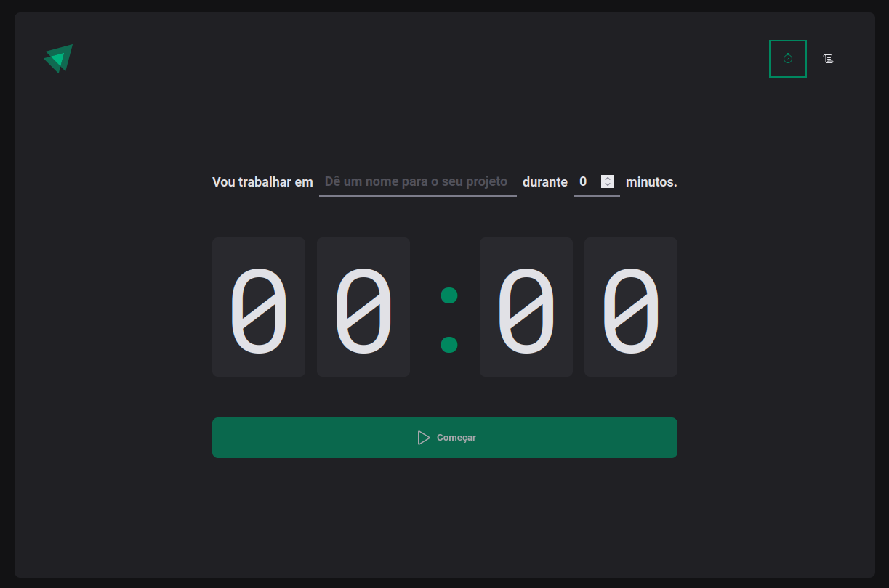
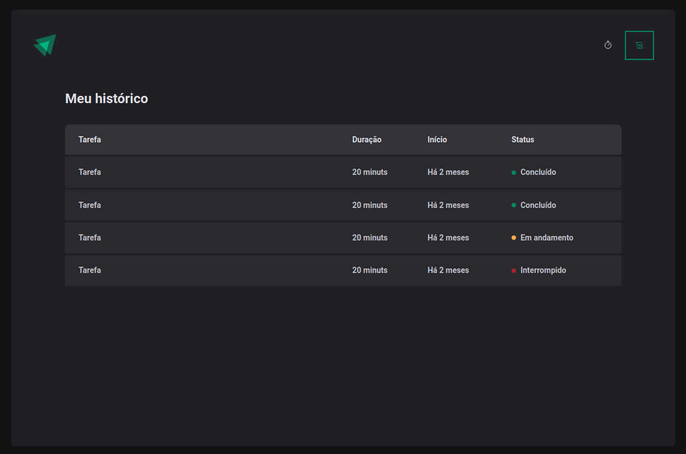

## Trilha Ignite - Projeto 02 - Ignite Timer

### Iniciando com React

npm create vite@latest

## Structure

## Technologies

This project was developed with the following technologies:

- [Reactjs](https://reactjs.org)
- [Vite](https://vitejs.dev/)
- [TypeScript](https://www.typescriptlang.org)
- [React Router]()
- [React Hook Form]()
- [Phosphor-react]()
- [Zod]()
- [Date fns]()

## Libraries

- npm i styled-components
- npm i @types/styled-components -D
- npm i eslint -D
- npm i @rocketseat/eslint-config -D
- npm i react-router-dom
- npm i phosphor-react
- npm i react-hook-form
- npm i zod
- npm i @hookform/resolvers
- npm i date-fns

## Contributors

## Educator

 <strong>Diego Fernandes</strong> CTO | @Rocketseat

## License

This project is under license from [Rocketseat](https://www.rocketseat.com.br/).
